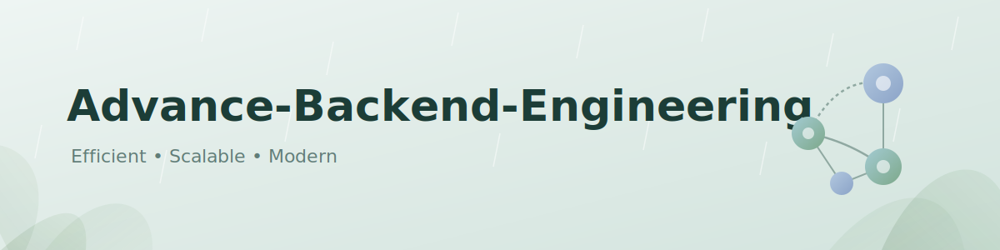

# Advance-Backend-Engineering

  

Advanced Backend Engineering: Production-grade backend systems, distributed architecture, scalability, reliability, cloud-native development, observability, security, and enterprise software engineering.

